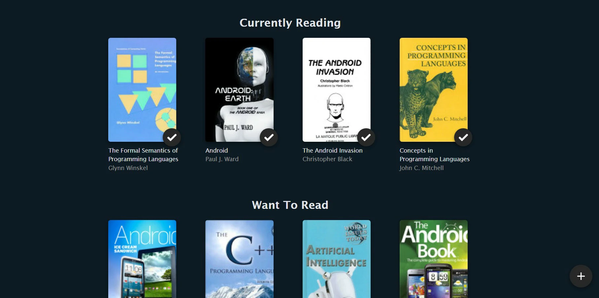

# My Reads App

A simple, React app that keeps track of your book readings.



## Table of contents

- 🚀 [Getting Started](#getting-started)
- :memo: [Credits](#credits)

## Getting Started

Clone the repo

```
git clone https://github.com/OmarMoBadr/BookShelf.git
```

Install all the required packages/dependencies using npm

```
npm install
```

Run the development server

```
npm start
```

### Credits

<a href="https://www.flaticon.com/free-icons/plus" title="plus icons">Plus icons created by srip - Flaticon</a>

<a href="https://www.flaticon.com/free-icons/right" title="right icons">Right icons created by Pixel perfect - Flaticon</a>

<a href="https://www.freepik.com/vectors/no-connection">No connection vector created by storyset - www.freepik.com</a>

<a href="https://www.flaticon.com/free-icons/bookshelf" title="bookshelf icons">Bookshelf icons created by smalllikeart - Flaticon</a>
